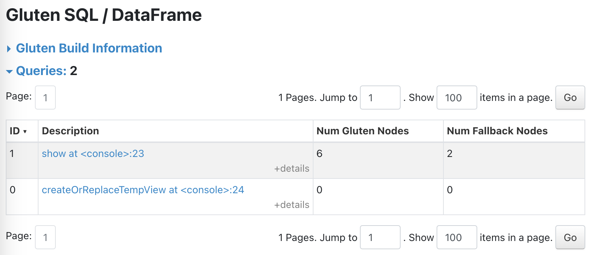

# spark-accelerators-demo

> [!NOTE]
> This repository is intended for demonstration purposes only. Its content is [APL-2.0](./LICENSE).

This repository contains a basic demonstration of using two open-source native accelerators for [Apache Spark](https://spark.apache.org/):

- [Apache Gluten](https://gluten.apache.org/) w/ [Velox](https://github.com/facebookincubator/velox) as a backend.
- [Apache DataFusion Comet](https://datafusion.apache.org/comet/)

The intended audience here is anyone looking to start experimenting with these accelerators who may already be familiar with Spark itself but not with the accelerators.

## Setup

Beyond performance (query execution time, memory usage during query execution), a key concern anyone experimenting with Spark accelerators must be aware of is _compatibility_.

Specifically,

1. Which Java version(s) are supported?
2. Which Spark version(s) are supported and tested?
3. Which Spark expressions and operators are supported?

For example, Gluten only runs on Java 8 and each Gluten release only claims support for a single Spark version.
DataFusion Comet, on the other hand, is more flexible and can run on multiple Java and Spark versions.
For the purposes of this demo, we're using a version of Spark that is compatible with the version of Gluten we'll be building: Spark 3.4.2.

Download Spark 3.4.2 from https://archive.apache.org/dist/spark/spark-3.4.2/spark-3.4.2-bin-hadoop3.tgz.

Beyond that, in order to run through this demo, you'll need:

- A Debian or RHEL-based Linux system with superuser privileges (mainly for building Gluten)
- git
- Java 8
- A Rust toolchain

## Gluten w/ Velox

Gluten supports either [Velox](https://github.com/facebookincubator/velox) or [Clickhouse](https://clickhouse.com/) as an execution engine.
We'll be using the Velox backend here as it's fairly well-documented.

### Building Gluten w/ Velox

The Gluten project tries to provide a small set of binaries in their [Releases on GitHub](https://github.com/apache/incubator-gluten/releases) but I didn't have any luck running them.
Therefore I recommend building Gluten yourself which is challenging but doable.

Please note:

1. The [official Gluten build documentation](https://gluten.apache.org/docs/velox/getting-started) has you run commands which use `sudo`, are not self-contained, and modify your fileystem so I recommended running these commands on a test system, inside a container, or in a virutal machine.
2. I wasn't able to run their all-in-one build script, `./dev/buildbundle-veloxbe.sh`, so my instructions here differ from Gluten's a bit.


Run the following commands:

```sh
git clone https://github.com/apache/incubator-gluten
cd ep/build-velox/src
./get_velox.sh # must run this first, build-velox doesn't sync for me
./build_velox.sh
cd ../../../cpp
./compile.sh --build_velox_backend=ON
cd ..
mvn clean package -Pbackends-velox -Prss -Pspark-3.4 -DskipTests
```

You should now have a binary JAR in `./package/target` named something like `gluten-velox-bundle-spark3.4_2.12-debian_12_x86_64-1.2.0-SNAPSHOT.jar`.

### Using Gluten

Now we can launch a local mode Spark Shell to test that our built JAR works:

```sh
export SPARK_HOME="/path/to/your/spark-3.4.2-bin-hadoop3"
export GLUTEN_JAR="/path/to/your/built/gluten.jar"

"$SPARK_HOME/bin/spark-shell" \
    --conf spark.plugins=org.apache.gluten.GlutenPlugin \
    --conf spark.memory.offHeap.enabled=true \
    --conf spark.memory.offHeap.size=20g \
    --conf spark.shuffle.manager=org.apache.spark.shuffle.sort.ColumnarShuffleManager \
    --conf spark.driver.extraClassPath=$GLUTEN_JAR \
    --conf spark.executor.extraClassPath=$GLUTEN_JAR
```

Once we're in the Spark Shell, we can run a basic query and ask for an EXPLAIN to check that our query will be executed with Velox:

```scala
scala> spark.sql("select 1;").explain
== Physical Plan ==
VeloxColumnarToRowExec
+- ^(3) ProjectExecTransformer [1 AS 1#58]
   +- ^(3) InputIteratorTransformer[fake_column#60]
      +- ^(3) InputAdapter
         +- ^(3) RowToVeloxColumnar
            +- *(1) Scan OneRowRelation[fake_column#60]
```

You can also open the Spark UI at https://localhost:4040 (by default) and see that Gluten adds a new UI tab for inspecting query plans.

Borrowing from the section on Comet later on in this README, we can create some test Parquet data:

```scala
scala> (0 until 10).toDF("a").write.mode("overwrite").parquet("/tmp/test")
```

This should print quite a lot of debug info (which is not shown here) which may be interesting.

```scala
scala> spark.read.parquet("/tmp/test").createOrReplaceTempView("t1")
```

Now we can run a basic query to see that Velox picks up the filter pushdown:

```scala
scala> spark.sql("select * from t1 where a > 5").explain
== Physical Plan ==
VeloxColumnarToRowExec
+- ^(2) FilterExecTransformer (isnotnull(a#7) AND (a#7 > 5))
   +- ^(2) NativeFileScan parquet [a#7] Batched: true, DataFilters: [isnotnull(a#7), (a#7 > 5)], Format: Parquet, Location: InMemoryFileIndex(1 paths)[file:/tmp/test], PartitionFilters: [], PushedFilters: [IsNotNull(a), GreaterThan(a,5)], ReadSchema: struct<a:int>
```

## Apache DataFusion Comet

### Building Comet

The following steps are taken from the [Comet Installation User Guide](https://datafusion.apache.org/comet/user-guide/installation.html).

```sh
git clone https://github.com/apache/datafusion-comet.git
cd datafusion-comet
make release PROFILES="-Pspark-3.4"
```

### Running Comet

Running a Spark Shell w/ comet is very similar to how we ran Gluten.

```sh
export SPARK_HOME="/path/to/your/spark-3.4.2-bin-hadoop3"
export COMET_JAR "/path/to/target/comet-spark-spark3.4_2.12-0.1.0-SNAPSHOT.jar"

"$SPARK_HOME/bin/spark-shell" \
    --jars $COMET_JAR \
    --conf spark.driver.extraClassPath=$COMET_JAR \
    --conf spark.executor.extraClassPath=$COMET_JAR \
    --conf spark.sql.extensions=org.apache.comet.CometSparkSessionExtensions \
    --conf spark.comet.enabled=true \
    --conf spark.comet.exec.enabled=true \
    --conf spark.comet.exec.all.enabled=true \
    --conf spark.comet.explainFallback.enabled=true
```

Note:

- `spark.comet.enabled` enables Comet
- `spark.comet.exec.enabled` enables execution with Comet (instead of Spark)
- `spark.comet.exec.all.enabled` turns on all Comet operators, instead of enabling operators one-by-one
- `spark.comet.explainFallback.enabled` turns on logging when fallbacks are encountered

Once the shell starts, we can test a simple query just to check that Comet is working:

```scala
scala> spark.sql("select 1").explain
24/05/26 20:17:11 INFO src/lib.rs: Comet native library initialized
24/05/26 20:17:11 WARN CometSparkSessionExtensions$CometExecRule: Comet cannot execute some parts of this plan natively because Scan OneRowRelation is not supported
== Physical Plan ==
*(1) Project [1 AS 1#0]
+- *(1) Scan OneRowRelation[]
```

This next bit is taken from the [Comet Installation Guide](https://datafusion.apache.org/comet/user-guide/installation.html) and does a nice job showing (1) logging in the case of fallbacks and (2) how Comet takes over parts of a plan, pushing a filter down into its Parquet scanner.

```scala
scala> (0 until 10).toDF("a").write.mode("overwrite").parquet("/tmp/test")
24/05/26 20:17:37 WARN CometSparkSessionExtensions$CometExecRule: Comet cannot execute some parts of this plan natively because:
	- LocalTableScan is not supported
	- WriteFiles is not supported
	- Execute InsertIntoHadoopFsRelationCommand is not supported
```

```scala
scala> spark.read.parquet("/tmp/test").createOrReplaceTempView("t1")
24/05/26 20:17:55 WARN CometSparkSessionExtensions$CometExecRule: Comet cannot execute some parts of this plan natively because Execute CreateViewCommand is not supported
```

```scala
scala> spark.sql("select * from t1 where a > 5").explain
== Physical Plan ==
*(1) ColumnarToRow
+- CometFilter [a#9], (isnotnull(a#9) AND (a#9 > 5))
   +- CometScan parquet [a#9] Batched: true, DataFilters: [isnotnull(a#9), (a#9 > 5)], Format: CometParquet, Location: InMemoryFileIndex(1 paths)[file:/tmp/test], PartitionFilters: [], PushedFilters: [IsNotNull(a), GreaterThan(a,5)], ReadSchema: struct<a:int>
```

In contrast with Gluten, Comet does not currently extend the Spark UI (See [datafusion-comet/144](https://github.com/apache/datafusion-comet/issues/144)).

## Comparison

To get a more realistic view of how vanilla Spark, Gluten, and Comet compare, let's run a query against the [NYC Taxi trip record dataset](https://www.nyc.gov/site/tlc/about/tlc-trip-record-data.page).
For simplicity, we're just using local-mode Spark and not a Spark cluster so the results here may not be reproducible in a real Spark deployment.

### Getting The Data

A copy of the dataset is hosted on S3 at `s3://ursa-labs-taxi-data"/nyc-taxi`.
The files can be downloaded with the AWS CLI or similar:

```sh
aws s3 cp \
   --no-sign-request \
   --recursive \
   "s3://voltrondata-labs-datasets/nyc-taxi" \
   ~/Datasets/nyc-taxi
```

### Test Scenario

We'll run the exact same commands in each Spark Shell which essentially makes the NYC Taxi dataset available to Spark and then runs an aggregation query on it:

```scala
var trips = spark.read.parquet("/home/bryce/Datasets/nyc-taxi")
trips.createOrReplaceTempView("trips")
spark.sql("SELECT extract(year from pickup_datetime) as trip_year, extract(month from pickup_datetime) as trip_month, extract(hour from pickup_datetime) as trip_hour, avg(trip_distance) as avg_trip_distance, round(avg(total_amount), 2) as avg_total_amount, round(avg(tip_amount), 2) as avg_tip_amount, count(*) as num_trips FROM trips GROUP BY trip_year, trip_month, trip_hour ORDER BY trip_year, trip_month, trip_hour;").show
```

In a more readable form, the query is:

```sql
SELECT
   extract(year from pickup_datetime) as trip_year,
   extract(month from pickup_datetime) as trip_month,
   extract(hour from pickup_datetime) as trip_hour,
   avg(trip_distance) as avg_trip_distance,
   round(avg(total_amount), 2) as avg_total_amount,
   round(avg(tip_amount), 2) as avg_tip_amount,
   count(*) as num_trips
FROM
   trips
GROUP BY
   trip_year, trip_month, trip_hour
ORDER BY
   trip_year, trip_month, trip_hour;
```

The timings are from running on a Ryzen 5800H w/ 32GiB of RAM:

|         Scenario         |  Time  |
| ------------------------ | ------ |
| Spark 3.4.1              | 1.4min |
| + Gluten w/ Velox        | 2.2min |
| + Comet, default         | 2.0min |
| + Comet w/ Comet Shuffle | 1.8min |

This result might be surprising since we might expect Spark to be slower than the accelerators but I think some of the slowdown is likely due to fallbacks.
However, given such similar timings, I expect that if we were to run the same workload against a cluster with four or more workers we'd get better timings from each of the accelerators.

### Gluten

There's no output in the Spark Shell when we run the query but Gluten's UI shows a lot of information.
Gluten helpfully shows our query had two fallback nodes:



Most of the interesting information Gluten provides is available in the Spark UI and I didn't include it here due to its size.

### Comet

Comet prints all of its debug information to the shell and the output for this query shows relevant warnings.
This is the output of our query when we ran Comet with Comet Shuffle disabled:

```scala
scala> spark.sql("SELECT extract(year from pickup_datetime) as trip_year, extract(month from pickup_datetime) as trip_month, extract(hour from pickup_datetime) as trip_hour, avg(trip_distance) as avg_trip_distance, round(avg(total_amount), 2) as avg_total_amount, round(avg(tip_amount), 2) as avg_tip_amount, count(*) as num_trips FROM trips GROUP BY trip_year, trip_month, trip_hour ORDER BY trip_year, trip_month, trip_hour;").show
24/05/28 20:13:41 WARN CometSparkSessionExtensions$CometExecRule: Comet cannot execute some parts of this plan natively because:
        - Comet does not guarantee correct results for cast from TimestampNTZType to DateType with timezone Some(US/Alaska) and evalMode LEGACY. To enable all incompatible casts, set spark.comet.cast.allowIncompatible=true
        - month is not supported
        - Comet shuffle is not enabled: spark.comet.exec.shuffle.enabled is not enabled
        - TakeOrderedAndProject requires shuffle to be enabled
24/05/28 20:13:41 WARN CometSparkSessionExtensions$CometExecRule: Comet cannot execute some parts of this plan natively because:
        - Comet does not guarantee correct results for cast from TimestampNTZType to DateType with timezone Some(US/Alaska) and evalMode LEGACY. To enable all incompatible casts, set spark.comet.cast.allowIncompatible=true
        - month is not supported
        - Comet shuffle is not enabled: spark.comet.exec.shuffle.enabled is not enabled
        - TakeOrderedAndProject requires shuffle to be enabled
24/05/28 20:13:41 WARN CometSparkSessionExtensions$CometExecRule: Comet cannot execute some parts of this plan natively because:
        - Comet does not guarantee correct results for cast from TimestampNTZType to DateType with timezone Some(US/Alaska) and evalMode LEGACY. To enable all incompatible casts, set spark.comet.cast.allowIncompatible=true
        - month is not supported
        - Comet shuffle is not enabled: spark.comet.exec.shuffle.enabled is not enabled
```
